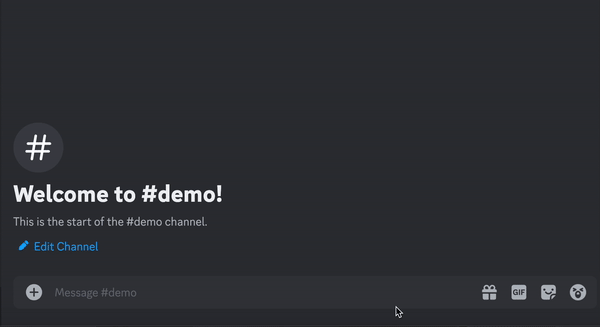

#  Century Pay

<p align="center">
<a href="https://discord.com/oauth2/authorize?client_id=1269633218811002880">

</a>
</p>

Century Pay is a **Discord bot** designed to simplify on-chain payments. Users can effortlessly connect their wallets and perform transactions using simple Discord commands. Whether it's sending ETH, accessing a faucet, or staking ETH for the ETHGlobal hackathon, Century Pay streamlines the process.

Thanks to the integration with **AA wallets**, on-chain interactions have never been easier. Users can sign in securely with a passkey, and their gas fees will be covered by a paymaster. When interactions require sending values—such as voting or minting NFTs—the bot provides clear guidance to help users navigate smart contract interactions seamlessly!

## Architecture

-   [📄 contracts](./contracts): Example voting smart contracts. It allows users to create vote session, vote and tally.
-   [🎯 server](./server): The server of the Century Pay discord bot. It handles the commands from users and gives responses.
-   [🧩 web](./web): Century Pay's website. Since the users cannot execute javascript or any other code execution in discord, Century Pay bot redirects users to the website to sign and send transactions with their own wallets.

## Technology

1. [Alchemy Embedded Accounts](https://aa-sdk-site-alpha.vercel.app/react/quickstart): Alchemy provides AA accounts infrastructure and its gas master. It allows users to send transaction without having ETH at first.
2. [Base smart wallet](https://www.coinbase.com/wallet/smart-wallet): It is one of the AA accounts infrastructure. It allows users to create an smart wallet easily.
3. [WalletConnect](https://walletconnect.com/): We use the wallet connect frontend components to let users connect their own wallets. It supports many networks and many wallets.
4. [Blockscout](https://www.blockscout.com/): Blockscout makes users' transactions more visible and clear in this app and it supports multiple chains.
5. [Discord bot](https://discord.com/developers/docs/intro): The discord bot is used to handle the requests and send responses to users.
6. [Mongodb](https://www.mongodb.com/): It handles user's data and connect the discord bot and the Century Pay website.

## Features

### `/connect`

-   Description: It let a user to connect to a wallet, and the bot will save the user's address in database (for the future usage).
    

### `/check`

-   Description: It let a user to check which wallet he/she is connecting to. It outputs an Ethereum address.
    

### `/send`

-   Description: It lets the sender to specify the receiver's address and how much will be sent
-   Inputs
    -   `amount`: `string`
        -   parse ETH in string
        -   e.g. `0.001` means 0.001 ETH
    -   `to_address`: `string`
        -   Either an Ethereum account or tag a user
        -   e.g. `0x123...` or `@vivi432`
-   After a transaction is sent, it notifies both sender and receiver with a private chat message.
    

### `/faucet`

-   Description: It automatically sends some ETH (0.001 ETH) to the user's wallet if the user has connected to an address.
-   Options: `Sepolia`, `OptimismSepolia`, `BaseSepolia`
    

### `/createVote`

-   Description: It enables each user to create a vote session and everyone can join the vote by an AA wallet.
-   Inputs

    -   `topic`: `string`
        -   The topic to be voted for
    -   `option1`,...,`option10`: `string`
        -   The candidates of the vote
        -   min: 2, max: 10

    

### `/vote`

-   Description: It allows users to find which vote session is happening, and users can vote for the specified session. After users choose an option, the bot redirects users to confirm the vote with an AA wallet.
-   Selectors

    -   `topic`
        -   The topic of the vote
    -   `option`
        -   The option of the vote

    

### `/tally`

-   Description: Users can close the vote session with the tally command. It also redirects the user to connect an AA account to confirm the transaction.
    

## Installation

### [📄 contracts](./contracts):

-   Installation

```shell
npm install
```

-   Test

```shell
npx hardhat test
```

### [🎯 server](./server)

-   Installation

```shell
npm install
```

-   Register commands

```shell
npm run register
```

-   Start the server

```shell
npm run dev # for dev
npm run start # for prod
```

-   Deployment: https://century-pay.vercel.app/

```shell
vercel # for dev
vercel --prod # for prod
```

### [🧩 web](./web)

-   Installation

```shell
pnpm install
```

-   Start the server

```shell
pnpm dev # for dev
pnpm start # for prod
```

-   Deployment: https://century-pay-web.vercel.app/

```shell
vercel # for dev
vercel --prod # for prod
```

## Future work

-   **Universal transaction**

    -   Now we only implement the payment and vote, but it can be extended to

        1. transfer ERC20 tokens or NFT token
        2. interact with different smart contracts
        3. deploy smart contracts

        that transactions needs users' signatures

-   **General push notification**

    -   Now the server only listens to specific events. But it can be extended to many others. And ideally we want the users can be notified by all the transactions happening on each chain.

-   **In-app wallet connection**

    -   Discord only supports text, button, links... in the chatroom, and it _cannot perform computation_ before sending commands. We cannot connect to a secured wallet in the discord app. If Discord can support javascript computation in chatroom, we don't need to redirect users to frontend wallet website.

-   **Purchase and exchange tokens**
    -   We can connect like Apple pay to let users buy tokens within Discord
    -   And users can exchange assets within Discord
